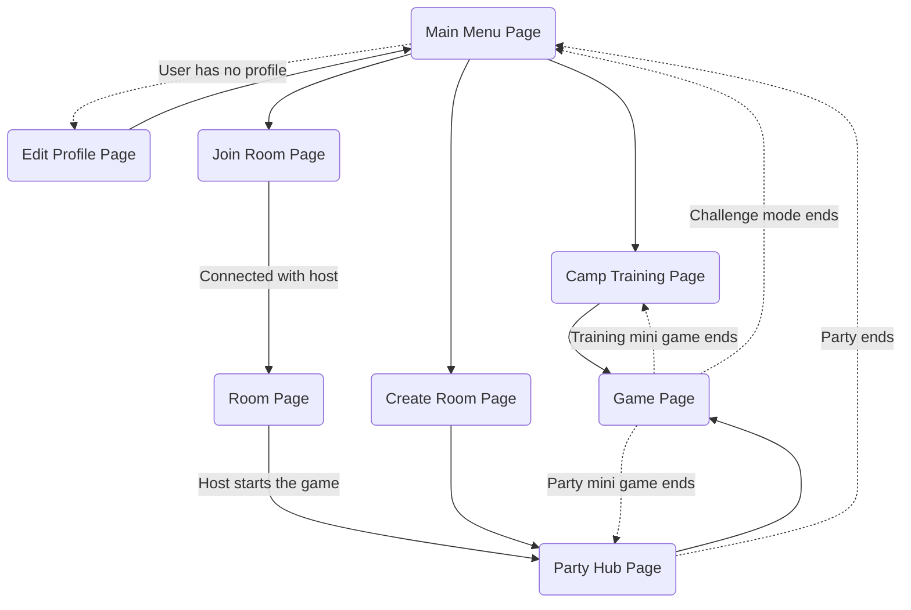
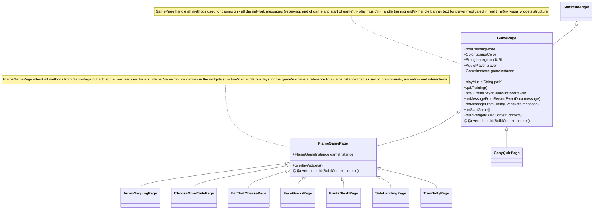
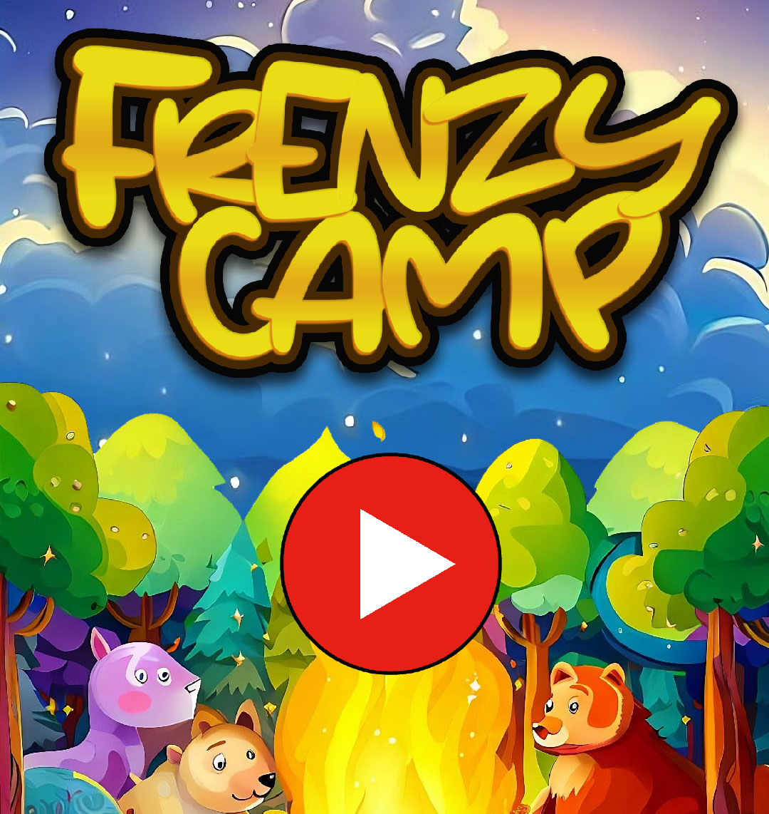

<h1 align="center">Frenzy Camp</h1>
<h4 align="center">1v1 Multiplayer mini games party</h4>
<p align="center">
   
   
   
    
</p>

---

Frenzy Camp is a Flutter project that enables peer-to-peer connectivity for an 1v1 multiplayer gaming experience. 
This repository contains a collection of eight distinct mini-games, where players can connect with each other and engage in thrilling battles across a series of five randomly selected mini-games.

Made by  :
- [Romain Briend](https://github.com/yami2200/)
- [Mael Kerichard](https://github.com/Pixselve)

## 📖 Quick Reminder

This project was created as a school project for Mobile programming.

### 📋 Requirements
- ✅ main menu
- ✅ 6 games with required categories (quiz, sensor, gesture)
- ✅ solo game mode that launches a series of 3 random games
- ✅ Discover p2p devices
- ✅ 1v1 multiplayer game mode where the room owner choose the device to connect to
- ✅ synchronize game launch between devices
- ✅ multiplayer score leaderboard
- ✅ At the end, the winner is displayed. Each device has a winning or losing music.

### 📚 Additional features
- 2 additional games
- 1v1 multiplayer game mode that launch a series of 5 random games (each game grants 0 to 20 points)
- Profile with username and avatar (avatar is displayed as the player in different games)
- Profile stored on the device
- Training mode : play any game without a friend
- Synchronize gaming: each mini game in multiplayer is launched at the same time on both devices
- Real time: most of the game have realtime features replication (score, movements, animations, etc. sent in realtime to the other player)
- Party hub : between each multiplayer mini game, the players are sent to a party hub where they can see scores and have 10 seconds to read the description of the next game
- Different musics for each mini game. 2 sounds to indicate that the game starts or is finished.
- Multiplayer header banner : a banner is displayed at the top of the screen to indicate avatar and tag of player. It also indicates score or progress in realtime for every mini-games.

# 🎮 Games

## 1. 🎭 Face Guess
**Description :** Face Guess is a mini-game that puts your observation and timing skills to the test. 
Players are presented with a random face consisting of eyes, nose, mouth, and face shape. 
The face is displayed for a brief 8-second period before disappearing. 
After the countdown, players must click on each face element at the right moment as they appear in a loop.

**Input :** tap on the screen

**Features :**
- Tap event detection
- Real-time face element animation replication

**Screenshots & gif :**


## 2. 🍉 Fruits Slash:
**Description :** Fruits Slash is a game that puts your slicing skills to the test. As fruits move across the screen, your objective is to slice them before your opponent does and proving your lightning-fast reflexes.

**Input :** finger gesture on the screen.

**Features :**
- Gesture event detection
- Moving objects animation with slicing collision
- Real-time score replication

**Screenshots & gif :**


## 3. 🏹 Arrow Swiping:
**Description :** Arrow Swiping is a game that tests your reflexes and accuracy. In this exciting challenge, arrows swiftly descend from the top to the bottom of the screen, and it's your task to swipe in the direction of each arrow before it reaches the bottom.

**Input :** swipe gesture on the screen.

**Features :**
- Gesture event detection
- Moving objects animation with replicated spawn.

**Screenshots & gif :**


## 4. 🧀 Eat that cheese:
**Description :** Eat That Cheese is a game that puts you in control of a hungry little mouse on a mission to devour cheese. Your objective is simple: be the first to eat five delicious wedges of cheese before your opponent does.
Using the motion sensors of your phone, the mouse responds to the rotation of your device, moving in the direction corresponding to the phone's rotation.

**Input :** gyroscope motion.

**Features :**
- Gyroscope event motion detection
- Cheese spawn points replicated on both devices

**Screenshots & gif :**


## 5. 🚂 Train Tally:
**Description :** Train Tally is a game that tests your counting skills. In this challenge, a train consisting of a random number of wagons will appear on the screen. Your objective is to count the number of passengers and tap on the screen to select the correct number. 

**Input :** tap on the screen.

**Features :**
- Tap event detection
- Moving objects animation with replicated spawn locations of passengers.
- Each wagon has a different number of passengers and passengers can spawn at random window locations.

**Screenshots & gif :**


## 6. 🐻 Capyquiz:
**Description :** Capyquiz is a game that tests your knowledge of the animal kingdom of Capybaras. In this challenge, you will have to answer 5 questions and each good answer give you points.

**Input :** tap on the screen to select answer.

**Features :**
- Random questions
- Real Time score and progress replication to other player.

**Screenshots & gif :**


## 7. 🎲 Choose the good side:
**Description :** Choose the Good Side is an exciting and suspenseful game that challenges your luck and decision-making skills. You control an avatar that can move between two platforms for a limited time of 8 seconds. At the end of the countdown, both players plummet downwards, with one of the landing platforms rigged with deadly spikes. Your goal is simple: be the last one standing to claim victory.

**Input :** swipe gesture on screen.

**Features :**
- Gesture event detection
- Moving objects animation with replicated spawn locations of platforms.
- Replicated realtime movements of players

**Screenshots & gif :**


## 8. 🎈 Safe Landing:
**Description :** Safe Landing is a game that puts your timing and precision skills to the test. In this challenge, you find yourself in a freefall, and your objective is to open a trap that releases your player, timing it perfectly to land on the designated landing platform when the countdown is as close to zero seconds as possible.

**Input :** tap on the screen.

**Features :**
- Tap event detection
- Moving objects animation(gravity)
- Replicated realtime movements of players

**Screenshots & gif :**


## 🔧 Technical information :

### 1. Testing
The connectivity have been designed to implements a specific interface. This design allowed us to develop a peer-to-peer connectivity and a websocket connectivity without changing the code of the games.

To test the games, go in lib/utils/Config and enable devMode.
Then, go in dev_ws_server and run the server with the command : 
```
node server.js
```
Finally, run the app on two web browsers (chrome and edge have been used for the development).

### 2. Message exchange
The message exchange is based on a JSON format. The message is composed of a type and a data. The type is used to know what to do with the data. The data is a JSON object that contains all the information needed to execute the action.

We use auto generated code to serialize and deserialize the JSON object. To generate the json code, we use the command : 
```
flutter pub run build_runner build --delete-conflicting-outputs
```

### 3. Game Engine
In order to be able to develop performant games, we have used the Flame game engine. 
This engine is based on the Flutter engine and allows us to develop games with a good performance.
Our usage of this game engine has been mainly focus on SpriteComponents (used to display images) and on the update method (used to update the game state at each tick).
We used a bit of gesture event handler to detect movement and tap event on the screen. Some of the games also use collision detection.

### 4. Assets
All the assets used in the games are stored in the assets folder. 
All the images have been generated by AI with Bing Creator, then, we upscaled them with AI on [upscale.media](https://www.upscale.media/). For some of them, we did a bit of compositing.
Sounds and musics are not copyrights free and all credits goes to :
- "Finish, Start and win sounds" : from Mario Party 2 Voice announcer. (filenames : start.wav, win.wav, finish.wav)
- Capyquiz Music : Mario Party Superstars OST: Can It Be Done? (Mario Party 1) (filename : capyquiz.mp3)
- Arrow Swiping : Mario Party Superstars OST: Saving Courage (Mario Party 1) (filename : swipe.mp3)
- Face Guess : Mario Party Superstars OST: The Wide, Wide Ocean (Mario Party 1) (filename : faceguess.mp3)
- Train Tally : Mario Party Superstars OST: Let's Go Lightly (Mario Party 1) (filename : traintally.mp3)
- Eat that cheese : Mario Party Superstars OST: Ducking And Dodging (Mario Party 1) (filename : eatcheese.mp3)
- Choose the good side : Mario Party Superstars OST: The Blue Skies Yonder (Mario Party 2) (filename : goodside.mp3)
- Safe Landing : Mario Party Superstars OST: Spinning Polka (Mario Party 2) (filename : safelanding.mp3)
- Fruits Slash : Mario Party Superstars OST: Looking Ahead (Mario Party 3) (filename : fruits.mp3)

Audios files are not included in the repository.
If you have audio files, you can put them in the assets/audios folder.
Then go in lib/utils/Config and change the hasAudio variable to true.

### 5. Page structure :



### 6. Game structure :
The pages have been designed to be as modular as possible. Every multiplayer and solo game logic that are common to all mini games have been packed into GamePage class. All games pages inherit from this class. This class is also used to handle the network messages and the training mode.



# 📟 Demonstration :
[](https://youtu.be/mMLNND7GtqQ)