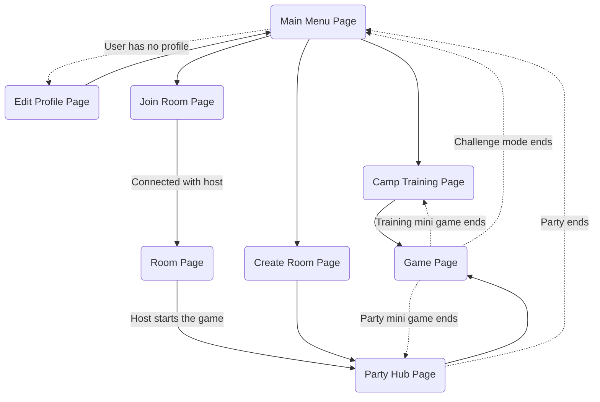

<h1 align="center">Frenzy Camp</h1>
<h4 align="center">1v1 Multiplayer mini games party</h4>
<p align="center">
   
   
   
    
</p>

---

Frenzy Camp is a Flutter project that enables peer-to-peer connectivity for an 1v1 multiplayer gaming experience. 
This repository contains a collection of eight distinct mini-games, where players can connect with each other and engage in thrilling battles across a series of five randomly selected mini-games.

## 📖 Quick Reminder

This project was created as a school project for Mobile programming.

# 🎮 Games

## 1. 🎭 Face Guess
**Description :** Face Guess is a mini-game that puts your observation and timing skills to the test. 
Players are presented with a random face consisting of eyes, nose, mouth, and face shape. 
The face is displayed for a brief 8-second period before disappearing. 
After the countdown, players must click on each face element at the right moment as they appear in a loop.

**Input :** tap on the screen

**Features :**
- Tap event detection
- Real-time face element animation replication

**Screenshots & gif :**


## 2. 🍉 Fruits Slash:
**Description :** Fruits Slash is a game that puts your slicing skills to the test. As fruits move across the screen, your objective is to slice them before your opponent does and proving your lightning-fast reflexes.

**Input :** finger gesture on the screen.

**Features :**
- Gesture event detection
- Moving objects animation with slicing collision
- Real-time score replication

**Screenshots & gif :**

## 3. 🏹 Arrow Swiping:


## 🔧 Technical information :

### 1. Testing
The connectivity have been designed to implements a specific interface. This design allowed us to develop a peer-to-peer connectivity and a websocket connectivity without changing the code of the games.

To test the games, go in lib/utils/Config and enable devMode.
Then, go in dev_ws_server and run the server with the command : 
```
node server.js
```
Finally, run the app on two web browsers (chrome and edge have been used for the development).

### 2. Message exchange
The message exchange is based on a JSON format. The message is composed of a type and a data. The type is used to know what to do with the data. The data is a JSON object that contains all the information needed to execute the action.

We use auto generated code to serialize and deserialize the JSON object. To generate the json code, we use the command : 
```
flutter pub run build_runner build --delete-conflicting-outputs
```

### 3. Game Engine
In order to be able to develop performant games, we have used the Flame game engine. 
This engine is based on the Flutter engine and allows us to develop games with a good performance.
Our usage of this game engine has been mainly focus on SpriteComponents (used to display images) and on the update method (used to update the game state at each tick).
We used a bit of gesture event handler to detect movement and tap event on the screen. Some of the games also use collision detection.

### 4. Assets
All the assets used in the games are stored in the assets folder. 
All the images have been generated by AI with Bing Creator, then, we upscaled them with AI on [upscale.media](https://www.upscale.media/). For some of them, we did a bit of compositing.
Sounds and musics are not copyrights free and all credits goes to :
- "Finish, Start and win sounds" : from Mario Party 2 Voice announcer. (filenames : start.wav, win.wav, finish.wav)
- Capyquiz Music : Mario Party Superstars OST: Can It Be Done? (Mario Party 1) (filename : capyquiz.mp3)
- Arrow Swiping : Mario Party Superstars OST: Saving Courage (Mario Party 1) (filename : swipe.mp3)
- Face Guess : Mario Party Superstars OST: The Wide, Wide Ocean (Mario Party 1) (filename : faceguess.mp3)
- Train Tally : Mario Party Superstars OST: Let's Go Lightly (Mario Party 1) (filename : traintally.mp3)
- Eat that cheese : Mario Party Superstars OST: Ducking And Dodging (Mario Party 1) (filename : eatcheese.mp3)
- Choose the good side : Mario Party Superstars OST: The Blue Skies Yonder (Mario Party 2) (filename : goodside.mp3)
- Safe Landing : Mario Party Superstars OST: Spinning Polka (Mario Party 2) (filename : safelanding.mp3)
- Fruits Slash : Mario Party Superstars OST: Looking Ahead (Mario Party 3) (filename : fruits.mp3)

Audios files are not included in the repository.
If you have audio files, you can put them in the assets/audios folder.
Then go in lib/utils/Config and change the hasAudio variable to true.

### 5. Page structure :

